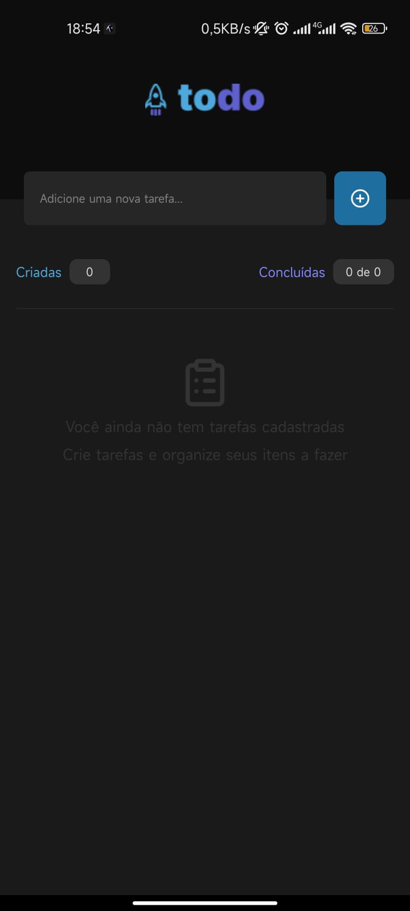
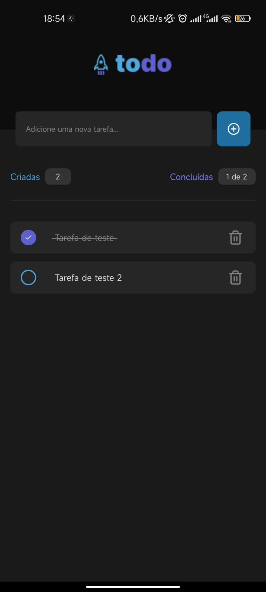

<h1 align="center"> To do list app </h1>

  <a href="#-tecnologias">Tecnologias</a>&nbsp;&nbsp;&nbsp;|&nbsp;&nbsp;&nbsp;
  <a href="#-projeto">Projeto</a>&nbsp;&nbsp;&nbsp;|&nbsp;&nbsp;&nbsp;
  <a href="#-layout">Layout</a>&nbsp;&nbsp;&nbsp;|&nbsp;&nbsp;&nbsp;
  <a href="#memo-licença">Licença</a>

  

 

  
  

## 🚀 Tecnologias

Esse projeto foi desenvolvido com as seguintes tecnologias:

- React Native
- StyleSheet
- TypeScript
- Git
- Github

## 💻 Projeto

Um projeto de aprendizado que serve para adicionar uma tarefas em uma lista de tarefas. Podendo deletar tarefas e marcar ou desmarcar as mesmas como concluidas ou não concluidas.

## 🔖 Layout

Você pode visualizar o projeto através do link abaixo:

- [Live Preview]()

## :memo: Licença

Esse projeto está sob a licença MIT.

---

Projeto proposto pela Rocketseat durante o curso de React Native do Ignite  
by Matheus Ramalho - [matheusramalho.dev](matheusramalho.dev)
